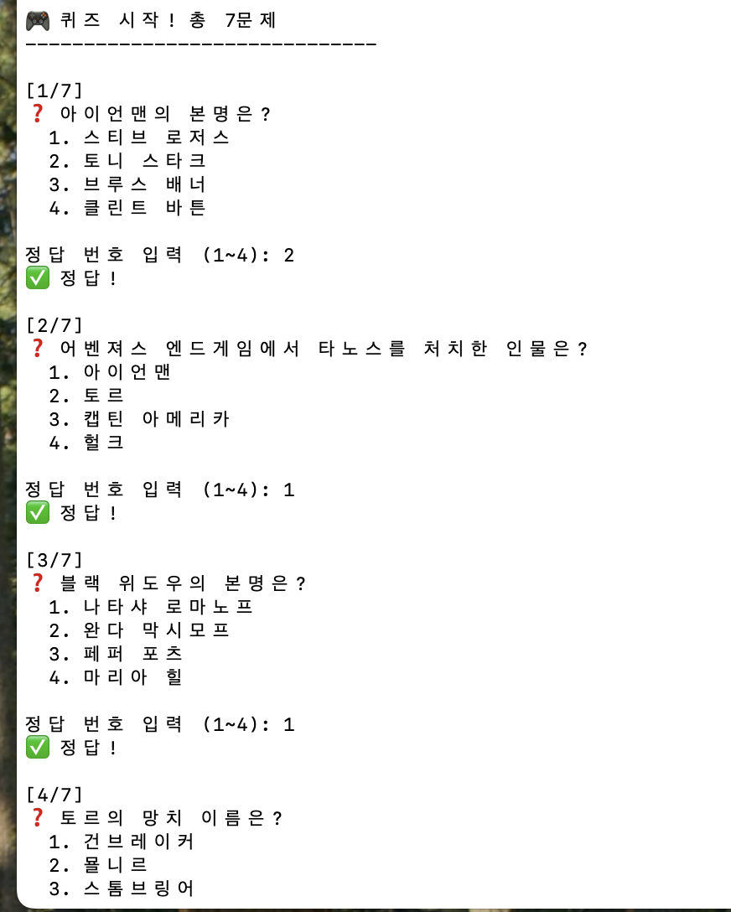
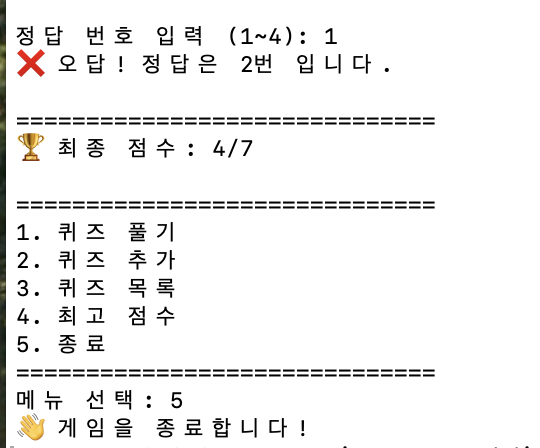

# 🦸 마블 영화 퀴즈 게임

> Python으로 만든 터미널 기반 퀴즈 게임 | Marvel Universe Quiz

---

## 📌 프로젝트 개요

이 프로젝트는 Python의 기본 문법과 객체 지향 프로그래밍(OOP)을 활용하여  
터미널에서 동작하는 **나만의 퀴즈 게임**을 처음부터 끝까지 직접 구현한 결과물입니다.

- **언어**: Python 3
- **주제**: 마블(Marvel) 영화 퀴즈
- **핵심 개념**: 클래스, JSON 파일 입출력, Git 버전 관리

---

## 🎯 퀴즈 주제 선정 이유

마블 영화를 주제로 선정한 이유는 두 가지입니다.

1. **친숙함**: 어벤져스, 아이언맨, 스파이더맨 등 많은 사람들이 알고 있는 콘텐츠라  
   퀴즈를 풀 때 흥미롭게 참여할 수 있습니다.
2. **다양성**: 마블 유니버스는 수십 편의 영화와 캐릭터가 있어  
   다양한 난이도의 퀴즈를 만들기 좋은 주제입니다.

---

## 🚀 실행 방법

### 1. 사전 준비
- Python 3.x 설치 필요

### 2. 저장소 클론
```bash
git clone https://github.com/[본인 GitHub 아이디]/[저장소 이름].git
cd [저장소 이름]
```

### 3. 프로그램 실행
```bash
python main.py
```

> ⚠️ `state.json` 파일이 없어도 자동으로 기본 퀴즈 데이터로 시작됩니다.

---

## 🎮 기능 목록

| 번호 | 기능 | 설명 |
|------|------|------|
| 1 | 퀴즈 풀기 | 저장된 퀴즈를 순서대로 풀고 결과를 확인 |
| 2 | 퀴즈 추가 | 새로운 퀴즈(문제/선택지 4개/정답)를 직접 등록 |
| 3 | 퀴즈 목록 | 현재 저장된 모든 퀴즈 목록 출력 |
| 4 | 점수 확인 | 지금까지의 최고 점수 확인 |
| 5 | 종료 | 프로그램 종료 (데이터 자동 저장) |

### 📸 실행 화면

**메인 메뉴**  


**퀴즈 풀기**  


**점수 확인**  


---

## 📁 파일 구조

```
📦 프로젝트 루트
├── main.py          # 프로그램 진입점 (QuizGame 실행)
├── quiz.py          # Quiz 클래스 / QuizGame 클래스 정의
├── state.json       # 퀴즈 데이터 및 최고 점수 저장 파일 (자동 생성)
├── .gitignore       # Git 추적 제외 파일 목록
└── README.md        # 프로젝트 설명 문서
```

---

## 💾 데이터 파일 설명 (state.json)

### 📍 경로
```
프로젝트 루트/state.json
```

### 🔧 역할
- 퀴즈 데이터와 최고 점수를 **영구 저장**합니다.
- 프로그램을 종료했다가 다시 실행해도 데이터가 유지됩니다.
- 파일이 없으면 기본 퀴즈 7개로 자동 초기화됩니다.
- 파일이 손상된 경우 기본 데이터로 복구됩니다.

### 📋 필드 구조 (스키마)
```json
{
  "quizzes": [
    {
      "question": "아이언맨의 본명은?",
      "choices": ["스티브 로저스", "토니 스타크", "브루스 배너", "클린트 바튼"],
      "answer": 2
    }
  ],
  "best_score": 5
}
```

```json
{
  "quizzes": [
    {
      "question": "아이언맨의 본명은?",
      "choices": ["스티브 로저스", "토니 스타크", "브루스 배너", "클린트 바튼"],
      "answer": 2
    },
    {
      "question": "캡틴 아메리카의 방패는 어떤 금속으로 만들어졌는가?",
      "choices": ["아다만티움", "비브라늄", "티타늄", "강철"],
      "answer": 2
    }
  ],
  "best_score": 5
}
```

| 필드 | 타입 | 설명 |
|------|------|------|
| `quizzes` | list | 퀴즈 객체 목록 |
| `quizzes[].question` | str | 퀴즈 문제 |
| `quizzes[].choices` | list[str] | 선택지 4개 |
| `quizzes[].answer` | int | 정답 번호 (1~4) |
| `best_score` | int | 역대 최고 점수 (맞힌 문제 수) |

---

### 🤔 왜 JSON을 선택했는가
별도 라이브러리 설치 없이 Python 표준 모듈(json)만으로 입출력이 가능합니다.
사람이 직접 열어서 읽고 수정하기 쉬운 텍스트 기반 포맷이라 디버깅이 편리합니다.
퀴즈 하나가 {question, choices, answer} 형태의 중첩 구조를 가지는데, JSON은
리스트와 딕셔너리를 그대로 표현할 수 있어 Quiz 객체와 1:1로 변환하기 쉽습니다.
지금 규모(퀴즈 수십~수백 개)에서는 DB 없이도 충분히 가볍고 빠릅니다.


## 🛡️ 예외 처리 및 백업 정책
파일 I/O 과정에서 발생할 수 있는 예외 상황과 대응 방식은 다음과 같습니다.

상황	예외 종류	대응
state.json 없음	FileNotFoundError	기본 퀴즈 7개로 초기화 후 새로 생성
state.json 내용 손상	json.JSONDecodeError	기본 데이터로 복구하고, 손상된 파일은 state.json.bak으로 백업 보관
저장 중 오류	OSError / PermissionError	사용자에게 오류 메시지를 출력하고 프로그램은 계속 진행(진행 중인 점수는 메모리상 유지)
사용자 입력 오류	ValueError	"숫자를 입력해주세요" 안내 후 재입력 요청

구현 예시 (quiz.py > load_state):
def load_state(self):
    try:
        with open("state.json", "r", encoding="utf-8") as f:
            data = json.load(f)
        self.quizzes = [Quiz.from_dict(q) for q in data.get("quizzes", [])]
        self.best_score = data.get("best_score", 0)
    except FileNotFoundError:
        self._load_default_quizzes()
    except json.JSONDecodeError:
        # 손상된 파일은 .bak으로 백업하고 기본 데이터로 복구
        shutil.copy("state.json", "state.json.bak")
        self._load_default_quizzes()

백업 규칙: state.json이 손상되어 복구가 발생하면 손상된 원본은 삭제하지 않고
state.json.bak으로 이름을 바꿔 보관합니다. 이를 통해 사용자가 원본 데이터를
직접 확인하거나 수동 복구를 시도할 수 있습니다.

## 🖐️ 안전 종료 (Ctrl+C)
사용자가 실행 도중 Ctrl+C(KeyboardInterrupt)를 눌러도 프로그램이 비정상 종료되지
않고, 지금까지의 진행 상황(최고 점수 등)을 저장한 뒤 안전하게 종료되도록 설계합니다.

구현 예시 (main.py > run 루프):
def run(self):
    try:
        while True:
            self.show_menu()
            choice = input("선택: ")
            # ... 메뉴 분기 처리 ...
    except KeyboardInterrupt:
        print("\n\n⚠️ 사용자에 의해 중단되었습니다. 데이터를 저장하고 종료합니다...")
        self.save_state()
        print("👋 게임을 종료합니다!")

이렇게 하면 퀴즈를 풀던 중 강제 종료하더라도 save_state()가 호출되어
state.json이 최신 상태로 유지됩니다.

## 🏗️ 코드 구조

### Quiz 클래스 (`quiz.py`)
> 개별 퀴즈 하나를 표현하는 클래스

| 메서드 | 역할 |
|--------|------|
| `__init__` | 문제/선택지/정답 초기화 |
| `display()` | 퀴즈 문제와 선택지 출력 |
| `check_answer(answer)` | 정답 여부 확인 |
| `from_dict(data)` | 딕셔너리 → Quiz 객체 변환 |
| `to_dict()` | Quiz 객체 → 딕셔너리 변환 |

### QuizGame 클래스 (`quiz.py`)
> 게임 전체 흐름을 관리하는 클래스

| 메서드 | 역할 |
|--------|------|
| `run()` | 메인 메뉴 루프 실행 |
| `play_quiz()` | 퀴즈 풀기 진행 |
| `add_quiz()` | 새 퀴즈 등록 |
| `show_quiz_list()` | 퀴즈 목록 출력 |
| `show_score()` | 최고 점수 출력 |
| `save_state()` | state.json에 저장 |
| `load_state()` | state.json에서 불러오기 |

---

## 🎯 왜 클래스(OOP)로 설계했는가
함수만으로 구현할 경우 퀴즈 데이터(문제/선택지/정답)와 그 데이터를 다루는
로직(출력, 채점)이 서로 분리되어 전역 변수나 인자 전달이 늘어나기 쉽습니다.
Quiz 클래스로 문제 하나의 상태와 행위(표시, 채점)를 하나로 묶어 데이터와
로직의 응집도를 높였습니다.
QuizGame 클래스는 여러 개의 Quiz 객체와 게임 진행 상태(최고 점수 등)를
관리하는 상위 단위로 분리해, "퀴즈 자체의 동작"과 "게임 전체 흐름"의
책임을 나눴습니다.
이후 퀴즈 유형이 추가되거나(예: 주관식) 저장 방식이 바뀌어도, 클래스
내부만 수정하면 되므로 함수형 구조보다 유지보수와 확장에 유리합니다.

## 📈 확장성 및 성능 고려사항 (퀴즈 1,000개 이상으로 늘어날 경우)

항목	현재 방식의 한계	개선 방향
메모리	load_state()에서 전체 퀴즈를 한 번에 메모리에 올림	퀴즈를 카테고리/난이도별로 분할 저장하고 필요한 부분만 로드
검색/필터	quizzes 리스트를 순차 탐색(O(n))	문제 ID를 key로 하는 dict 인덱스를 별도로 구성해 O(1) 조회
저장 성능	매번 전체 리스트를 JSON으로 통째로 dump	변경분만 갱신하거나, SQLite 같은 경량 DB로 전환해 부분 업데이트 지원
동시 접근	단일 사용자, 단일 프로세스를 전제로 설계됨	여러 사용자가 동시에 접근할 경우 파일 잠금(lock) 또는 DB 트랜잭션 필요

결론적으로 현재 규모(수십 개)에서는 JSON + 리스트 구조로 충분하지만,
1,000개 이상으로 확장 시 SQLite 등 경량 데이터베이스로 전환하는 것을
권장합니다.

## 🔧 Git 워크플로우
이 프로젝트는 기능 단위로 브랜치를 나눠 작업했습니다.

원격 저장소: https://github.com/[본인 GitHub 아이디]/[저장소 이름]

브랜치 전략
main            # 항상 실행 가능한 안정 버전 유지
├── feature/quiz-class      # Quiz/QuizGame 클래스 설계
├── feature/save-load       # state.json 저장/불러오기 기능
├── feature/error-handling  # 예외 처리 및 백업 정책
└── feature/safe-exit       # Ctrl+C 안전 종료 처리

각 기능 브랜치에서 작업을 완료한 뒤 main으로 Pull Request를 통해
병합(merge)했습니다. 브랜치를 나눠 작업한 이유는, 기능별로 작업 단위를
독립시켜 한 기능의 버그가 다른 기능 개발에 영향을 주지 않도록 하고,
병합 시점에 변경 이력을 명확히 남기기 위해서입니다.

커밋 메시지 규칙

prefix	의미	예시
feat	새로운 기능 추가	feat: Quiz 클래스 구현
fix	버그 수정	fix: 정답 인덱스 범위 오류 수정
docs	문서 수정	docs: README에 예외 처리 정책 추가
refactor	기능 변화 없는 코드 개선	refactor: load_state 함수 분리
test	테스트 코드 관련	test: check_answer 케이스 추가

커밋 단위: 하나의 커밋에는 하나의 논리적 변경만 포함되도록 하여
(예: "기능 구현"과 "오타 수정"을 한 커밋에 섞지 않음) 이력 추적이
쉽도록 했습니다.

커밋 히스토리
git log --oneline --graph
커밋 히스토리 스크린샷을 여기에 추가하세요! (10개 이상의 커밋, 브랜치 병합 그래프 포함)

### 사용한 Git 명령어
```bash
git init        # 저장소 초기화
git add         # 변경 파일 스테이징
git commit      # 변경 이력 저장
git push        # GitHub에 업로드
git pull        # 원격 변경사항 가져오기
git checkout    # 브랜치 이동/생성
git branch      # 브랜치 생성/조회
git merge       # 브랜치 병합
git clone       # 저장소 복제
```

## 🔩 요구사항 변경 시 참고용 매핑
자주 있을 법한 요구사항 변경과, 이때 수정해야 할 위치를 정리했습니다.

변경 요구사항	수정 위치
퀴즈 문제 형식 변경(예: 정답 다중 선택)	quiz.py > Quiz 클래스 전체
점수 계산 방식 변경	main.py > play_quiz() 내 score 계산 로직
저장 파일 형식 변경(JSON → 다른 포맷)	main.py > save_state() / load_state()
기본 퀴즈 목록 변경	main.py 또는 quiz.py > _load_default_quizzes()
메뉴 항목 추가/변경	main.py > run() 메인 메뉴 루프
