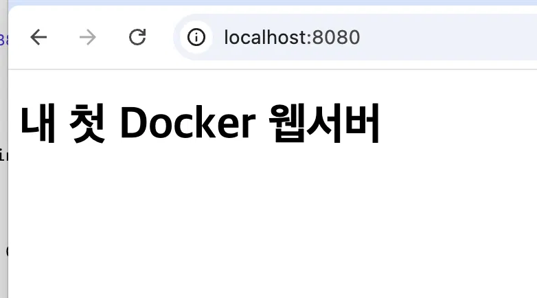

# 🦸 마블 영화 퀴즈 게임

> Python으로 만든 터미널 기반 퀴즈 게임 | Marvel Universe Quiz

---

## 📌 프로젝트 개요

이 프로젝트는 Python의 기본 문법과 객체 지향 프로그래밍(OOP)을 활용하여  
터미널에서 동작하는 **나만의 퀴즈 게임**을 처음부터 끝까지 직접 구현한 결과물입니다.

- **언어**: Python 3
- **주제**: 마블(Marvel) 영화 퀴즈
- **핵심 개념**: 클래스, JSON 파일 입출력, Git 버전 관리

---

## 🎯 퀴즈 주제 선정 이유

마블 영화를 주제로 선정한 이유는 두 가지입니다.

1. **친숙함**: 어벤져스, 아이언맨, 스파이더맨 등 많은 사람들이 알고 있는 콘텐츠라  
   퀴즈를 풀 때 흥미롭게 참여할 수 있습니다.
2. **다양성**: 마블 유니버스는 수십 편의 영화와 캐릭터가 있어  
   다양한 난이도의 퀴즈를 만들기 좋은 주제입니다.

---

## 🚀 실행 방법

### 1. 사전 준비
- Python 3.x 설치 필요

### 2. 저장소 클론
```bash
git clone https://github.com/[본인 GitHub 아이디]/[저장소 이름].git
cd [저장소 이름]
```

### 3. 프로그램 실행
```bash
python main.py
```

> ⚠️ `state.json` 파일이 없어도 자동으로 기본 퀴즈 데이터로 시작됩니다.

---

## 🎮 기능 목록

| 번호 | 기능 | 설명 |
|------|------|------|
| 1 | 퀴즈 풀기 | 저장된 퀴즈를 순서대로 풀고 결과를 확인 |
| 2 | 퀴즈 추가 | 새로운 퀴즈(문제/선택지 4개/정답)를 직접 등록 |
| 3 | 퀴즈 목록 | 현재 저장된 모든 퀴즈 목록 출력 |
| 4 | 점수 확인 | 지금까지의 최고 점수 확인 |
| 5 | 종료 | 프로그램 종료 (데이터 자동 저장) |

### 📸 실행 화면

**메인 메뉴**  


**퀴즈 풀기**  


**점수 확인**  


---

## 📁 파일 구조

```
📦 프로젝트 루트
├── main.py          # 프로그램 진입점 (QuizGame 실행)
├── quiz.py          # Quiz 클래스 / QuizGame 클래스 정의
├── state.json       # 퀴즈 데이터 및 최고 점수 저장 파일 (자동 생성)
├── .gitignore       # Git 추적 제외 파일 목록
└── README.md        # 프로젝트 설명 문서
```

---

## 💾 데이터 파일 설명 (state.json)

### 📍 경로
```
프로젝트 루트/state.json
```

### 🔧 역할
- 퀴즈 데이터와 최고 점수를 **영구 저장**합니다.
- 프로그램을 종료했다가 다시 실행해도 데이터가 유지됩니다.
- 파일이 없으면 기본 퀴즈 7개로 자동 초기화됩니다.
- 파일이 손상된 경우 기본 데이터로 복구됩니다.

### 📋 필드 구조 (스키마)
```json
{
  "quizzes": [
    {
      "question": "아이언맨의 본명은?",
      "choices": ["스티브 로저스", "토니 스타크", "브루스 배너", "클린트 바튼"],
      "answer": 2
    }
  ],
  "best_score": 5
}
```

| 필드 | 타입 | 설명 |
|------|------|------|
| `quizzes` | list | 퀴즈 객체 목록 |
| `quizzes[].question` | str | 퀴즈 문제 |
| `quizzes[].choices` | list[str] | 선택지 4개 |
| `quizzes[].answer` | int | 정답 번호 (1~4) |
| `best_score` | int | 역대 최고 점수 (맞힌 문제 수) |

---

## 🏗️ 코드 구조

### Quiz 클래스 (`quiz.py`)
> 개별 퀴즈 하나를 표현하는 클래스

| 메서드 | 역할 |
|--------|------|
| `__init__` | 문제/선택지/정답 초기화 |
| `display()` | 퀴즈 문제와 선택지 출력 |
| `check_answer(answer)` | 정답 여부 확인 |
| `from_dict(data)` | 딕셔너리 → Quiz 객체 변환 |
| `to_dict()` | Quiz 객체 → 딕셔너리 변환 |

### QuizGame 클래스 (`quiz.py`)
> 게임 전체 흐름을 관리하는 클래스

| 메서드 | 역할 |
|--------|------|
| `run()` | 메인 메뉴 루프 실행 |
| `play_quiz()` | 퀴즈 풀기 진행 |
| `add_quiz()` | 새 퀴즈 등록 |
| `show_quiz_list()` | 퀴즈 목록 출력 |
| `show_score()` | 최고 점수 출력 |
| `save_state()` | state.json에 저장 |
| `load_state()` | state.json에서 불러오기 |

---

## 🔧 Git 워크플로우

이 프로젝트는 기능 단위로 브랜치를 나눠 작업했습니다.

```bash
git log --oneline --graph
```

> 커밋 히스토리 스크린샷을 여기에 추가하세요!

### 사용한 Git 명령어
```bash
git init        # 저장소 초기화
git add         # 변경 파일 스테이징
git commit      # 변경 이력 저장
git push        # GitHub에 업로드
git pull        # 원격 변경사항 가져오기
git checkout    # 브랜치 이동/생성
git clone       # 저장소 복제
```

---

## 👤 개발자 정보

- **이름**: [본인 이름]
- **GitHub**: [본인 GitHub 주소]
